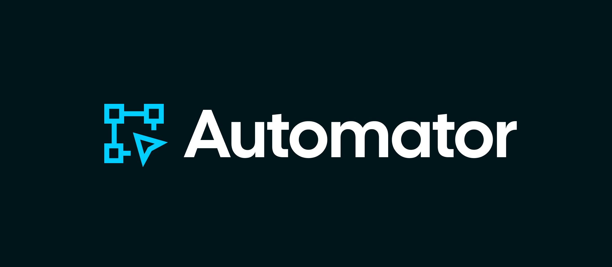

# Automator

**Build, simulate, and run onchain workflows on a visual canvas.**

Connect logic, AI agents, user interfaces, and onchain actions in a single flow, or describe a flow to the AI composer. Publish interactive flows as mini-apps and inspect each run step by step. Built for ETHOnline 2026.

[Live app](https://app.automator.ardasari.co) · [ETHGlobal project](https://ethglobal.com/showcase/automator-z7ono)

<br>

## What you can build

- **Onchain automations** — Send an alert when a token crosses a price threshold, respond to a contract event, or trigger a payout when your conditions are met.
- **AI workflows** — Route support requests by topic, turn free-form submissions into structured records, or let an agent query a subgraph before producing a response.
- **Interactive mini-apps** — Build an application form, a verified claim flow, or a wallet-connected signup experience. Share it through a link.

<br>

## Node types

- **Triggers** — Start flows manually, on a schedule, from webhooks or an HTTP API call, or in response to onchain events and price or balance thresholds.
- **Logic** — Branch, filter, loop, merge paths, set variables, run JavaScript, or answer the caller.
- **Data** — Create, find, update, and delete records in your workspace tables.
- **Onchain** — Read and write contracts, transfer tokens, and sign messages.
- **AI** — Generate text, classify inputs, extract structured data, or run an agent with selected tools.
- **Screens** — Add pages, forms, confirmations, and QR codes to mini-apps.
- **Notifications** — Send messages through Discord, Telegram, or email.
- **Integrations** — Add wallet access, identity verification, payments, and subgraph queries.

<br>

## Integrations

| | Integration | How Automator uses it |
| :--- | :--- | :--- |
|  | [Privy](apps/api/src/chain/provider.ts) | Handles sign-in and embedded wallets. Users can authorize server signing so their flows can send transactions without keeping a browser open. |
|  | [World ID](apps/api/src/world/verify.ts) | Adds World ID verification and Selfie Check screens to mini-apps. Verification results can determine which steps run next. |
|  | [The Graph](packages/flow-engine/src/graph.ts) | Queries indexed onchain data through subgraphs, including from AI agents. The Token API provides wallet balance data for balance triggers. |
|  | [Chainlink](apps/api/src/watch/price.ts) | Provides price feed data for triggers that respond when an asset crosses a configured threshold. |

Onchain flows currently run on Base Sepolia and World Chain Sepolia.

<br>

## Simulation & execution

Use **Simulate** to run a flow with sample inputs and inspect each node's outputs and errors. Mini-app screens use automatic responses so the flow can continue without visitor input.

By default, onchain writes are checked without broadcasting transactions, and Data nodes simulate writes. AI calls and notifications still reach their configured services. Each onchain check uses current chain state; simulated changes do not carry over to the next step.

Enable **Send real transactions** in flow settings to execute onchain writes with an authorized wallet. Transaction receipts and explorer links appear alongside node results.

<br>

## Architecture

```text
apps/
├── web/                Next.js dashboard and React Flow builder
├── runtime/            Published mini-app host
├── api/                Bun + Elysia API, execution, and triggers
├── landing/            Project website
└── ui-lab/             Shared component previews

packages/
├── flow-engine/        Workflow execution engine
├── contracts/          TypeBox schemas and shared types
├── api-client/         Typed HTTP client
├── db/                 PostgreSQL queries and migrations
├── miniapp/            Shared mini-app rendering
├── ui/                 Shared UI components
├── tailwind-config/    Theme tokens, fonts, and styles
└── typescript-config/  Shared TypeScript configuration
```

The monorepo uses TypeScript, Bun workspaces, and Turborepo. The builder and mini-app runtime communicate with the API, which handles authentication, flow execution, and persistence. Only the API accesses PostgreSQL; shared contracts keep data consistent across applications.

See [the architecture documentation](docs/architecture.md) for execution details and package boundaries.

<br>

## Getting started

Requires Bun, Node.js 22+, PostgreSQL, and a Privy app.

```sh
bun install
cp apps/api/.env.example apps/api/.env
cp apps/web/.env.example apps/web/.env.local
cp apps/runtime/.env.example apps/runtime/.env.local

# Configure the environment files, then start:
bun run dev
```

Add your database URL and service credentials to `apps/api/.env`, and set `NEXT_PUBLIC_PRIVY_APP_ID` in both frontend `.env.local` files. The example files explain each setting.

Open [localhost:3000](http://localhost:3000).
